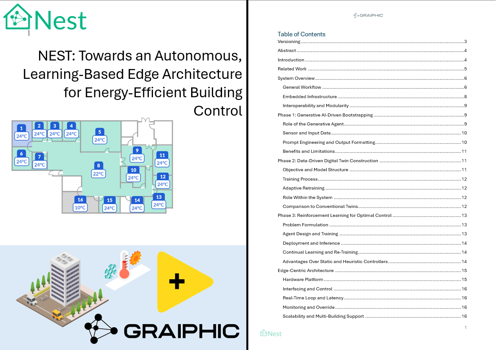
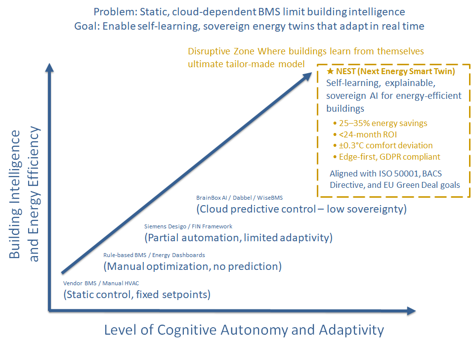

  

# 🌍 NEST – Next Energy Smart Twin

**Graiphic presents NEST**, a groundbreaking architecture enabling buildings to **learn, predict, and optimize their own energy behavior** — autonomously, locally, and efficiently.

  

  <b><a href="./Doc/NEST_Whitepaper_1.0.pdf">📘 Read the full NEST Whitepaper (PDF)</a></b>

---

## ⚡ Vision

Buildings account for **around 40% of global energy consumption** and a significant share of greenhouse gas emissions.  
Traditional Building Management Systems (BMS) remain **static**, **cloud-dependent**, and **unable to adapt** to evolving environmental and occupancy conditions.

**NEST (Next Energy Smart Twin)** changes this paradigm.  
It merges **Generative AI**, **Data-Driven Digital Twins**, and **Reinforcement Learning** into a unified, **self-learning and sovereign AI** that allows buildings to **understand themselves** and **adapt continuously**.

---

## 🧠 Architecture Overview

NEST operates through **three intelligent stages**, executed entirely **on the edge**:

1. **Generative AI Bootstrapping**  
   A large language model (LLM) initiates smart HVAC control using real-time data and semantic reasoning.  
   → *Instant intelligence without historical data.*

2. **Data-Driven Digital Twin Construction**  
   A predictive model learns the building’s thermal behavior and energy dynamics.  
   → *Continuous self-learning, no BIM or cloud required.*

3. **Reinforcement Learning Optimization**  
   An RL agent trains on the digital twin to discover optimal energy-control policies.  
   → *Fully autonomous, self-improving operation.*

All computation, storage, and control are embedded **locally**, ensuring:  
- 🔒 GDPR & ISO 50001 compliance  
- ⚙️ Ultra-low latency  
- 🧩 Full interoperability with existing BMS (BACnet, Modbus, MQTT)  
- 🌐 Zero cloud dependency  

---

## 📊 Disruptive Positioning

  

> **Disruptive Zone — Where buildings learn from themselves.**  
> NEST defines a new class of **sovereign, explainable AI** for real-time building energy optimization.

| Dimension | Classical BMS | Cloud Predictive Control | **NEST** |
|------------|----------------|--------------------------|-----------|
| Autonomy | Fixed rules | Limited adaptivity | **Self-learning** |
| Infrastructure | Cloud-dependent | Cloud-assisted | **Fully local** |
| Intelligence | Manual tuning | Partial prediction | **Full cognitive loop** |
| Energy Savings | <10 % | 15–20 % | **25–35 %** |
| ROI | >36 months | 30 months | **<24 months** |

---

## 🧩 Edge Infrastructure

NEST runs natively on **NVIDIA Jetson Orin**, **Jetson Nano**, or **DGX Spark (2025)** platforms.  
Built entirely on **ONNX Runtime (opset 20, IR 10)**, the framework executes learning, inference, and control directly on site.

Features:
- Local time-series database for telemetry  
- Embedded web dashboard for monitoring and manual override  
- Standard interfaces: BACnet, Modbus, MQTT, REST  
- Edge-first execution for privacy and resilience  

---

## 🌱 Impact and Research Context

- 💡 **Energy savings:** 25–35 %  
- 🕒 **ROI:** < 24 months  
- 🌡️ **Comfort deviation:** ± 0.3 °C  
- 📜 **Compliant with:** EU Green Deal, BACS Directive, ISO 50001  
- 🔬 **Scientific basis:** Generative AI + Digital Twin + Reinforcement Learning pipeline  

By turning each building into an **autonomous energy agent**, NEST aligns AI innovation with sustainability and sovereignty.

---

## 💡 Why It Matters

> “NEST transforms every building into a living, learning system — a true **Next Energy Smart Twin**.”

By embedding intelligence at the hardware layer, NEST eliminates cloud dependency, enhances explainability, and delivers measurable energy performance in real time.

---

## 🤝 Call for Partners & Funding

Graiphic invites collaboration with:
- **Equity investors** to scale NEST across Europe & Africa  
- **Industrial sponsors** for pilot deployments and validation sites  
- **HVAC, IoT & energy companies** integrating their technologies into NEST’s ONNX orchestration  

Join us in building the **universal cockpit for sovereign, energy-aware AI**.

📩 funding@graiphic.io  
🌐 [www.graiphic.io](https://www.graiphic.io)

---

## 📄 Documentation

- 📘 [NEST Whitepaper 1.0 (PDF)](./Doc/NEST_Whitepaper_1.0.pdf)  
- 🖼️ [Whitepaper Cover (PNG)](./img/NEST_Whitepaper.PNG)  
- 🧭 [Logo NEST (SVG)](./img/logo%20nest.svg)  
- 📊 [Orville Chart (PNG)](./img/Orvillechart_GTB.png)

---

## ⚖️ License

Distributed under the **MIT License**.  
© 2025 Graiphic — Advancing Sovereign AI for Energy Efficiency.
